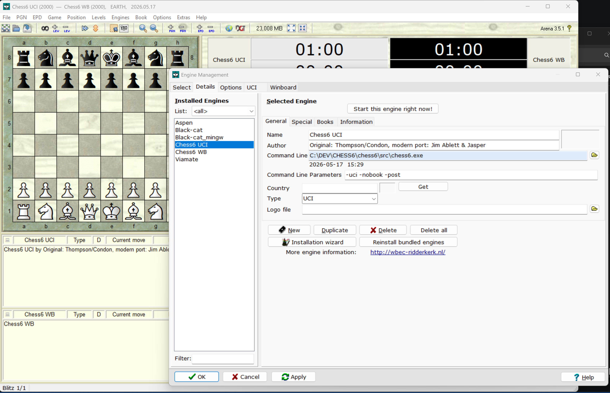

# PDP-11-Chess-VI-Belle
Groundbreaking 1970s/1980s era chess machine, now with full UCI support

## About Belle:
Developed by Ken Thompson and Joe Condon at Bell Labs in the late 70s/early 80s, the original Belle
was a pioneering, brute-force, special-purpose hardware chess machine.

## Features
It was the first machine to achieve master-level play (2250 USCF rating in 1983) and won the
ACM North American Computer Chess Championship five times.

## Port
This code has been ported and updated for modern systems by Jim Ablett, with recent fixes to its move
encoding, buffer overflows, and console mode. The port, which often runs via WinBoard, features an
integrated opening book (book.dat) and handles algebraic notation.

See: https://talkchess.com/viewtopic.php?t=86164

## Additions/Changes:

This repository contains Jim's orignal port and the following additions/changes:
- Full UCI support
- Parse FEN positions
- Call create_book() directly from UCI command line (previously this module was an independent program).
- Formatting -> 4 space tabs replaced with 2 space tabs
- Clang local variable and function parameter const warnings resolved

These don't change the core logic in any way, they are simplt compiler friendly improvements.

See: https://clang.llvm.org/extra/clang-tidy/checks/misc/const-correctness.html

Nothing else has been altered, as my intention was to change as little as possible in an effort to preserve the original programming of this historic engine, especially concerning the core functionality (movegen, search, eval, etc.)

## Protocol modes
The engine supports 3 modes: console, winboard, and UCI.
Protocol and play options are selected via command-line parameters.

For example:

- chess6.exe -uci -nobook -post
- chess6.exe -wb -nobook -post

You can use included wb.bat or uci.bat to start the engine this way.

## Console Mode
Console mode is the default if starting the engine without parameters-> "chess6.exe", after that just hit ENTER to start a game.

In console mode, you simply make your move in algebraic format, for ex: e2e4 then hit enter.
After the engine announces it's move, hit ENTER again to see the board reprentation.


## Arena
Choose Engines then Manage from the drop down menu.

Add -uci -nobook -post (or whatever options you want) to the engine's Command Line Parameter input field.



Have fun-
Jasper

## Book

To add openings, simply edit this function and add book lines.

```
int create_book(void){
  memset(tree,0,sizeof(tree));
  tree[0].depth = 0;
  
  // --- REPAIR: ALEKHINE (limited to 4 moves each) ---
  add_line("e2e4 g8f6 c2c3 d7d5 e4d5 d8d5 d2d4 c8f5");

  // --- WHITE REPERTOIRE (limited) ---
  add_line("e2e4 e5 g1f3 b8c6 f1c4 f8c5 c2c3 g8f6");
  add_line("d2d4 d5 c1f4 g8f6 e3 e6 g1f3 f8d6");
  add_line("e2e4 c7c5 c3 d5 e4d5 d8d5 d2d4 g8f6");

  // --- BLACK REPERTOIRE (limited) ---
  add_line("e2e4 c6 d2d4 d5 b1c3 d5e4 c3e4 c8f5");
  add_line("d2d4 d5 c4 e6 b1c3 g8f6 g1f3 f8e7");

  int current_ptr = 2;
  for (int i = 0; i < position_count; i++){
    if (tree[i].num_edges > 0){
      tree[i].file_offset = current_ptr;
      current_ptr += (tree[i].num_edges * 4);
    } else{
      tree[i].file_offset = 0;
    }
  }
  ```
  then enter 'book' from the UCI command line:
  
C:\DEV\CHESS6\chess6\src>chess6.exe -uci -nobook -post
- uci
- id name Belle PDP-11 (chess.6)
- id author Original: Thompson/Condon, modern port: Jim Ablett & Jasper
- uciok
- book
- Book Compiled Cleanly! Total Positions: 34
